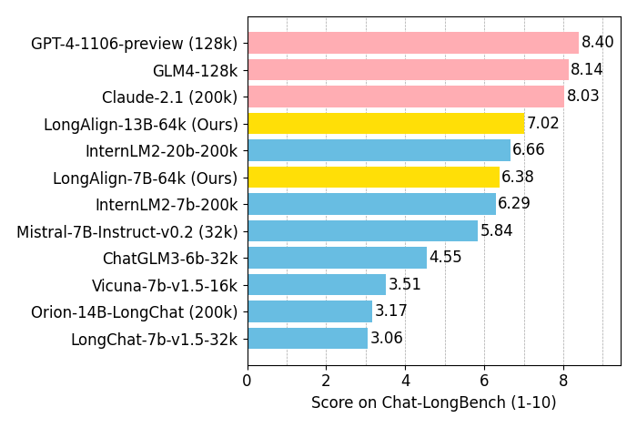

# LongAlign: A Thorough Recipe for Long Context Alignment

<p align="center">
    🤗 <a href="https://huggingface.co/datasets/THUDM/LongAlign-10k" target="_blank">HF Repo</a> • 📃 <a href="https://arxiv.org/" target="_blank">Paper</a>
</p>

**LongAlign** is the first full recipe for LLM alignment on long context. We propose the **LongAlign-10k** dataset, containing 10,000 long instruction data of 8k-64k in length. We investigate on trianing strategies, namely **packing (with loss weighting) and sorted batching**, which are all implemented in our code. For real-world long context evaluation, we introduce **Chat-LongBench** that evaluates the instruction-following capability on queries of 10k-100k length.



## 🔍 Table of Contents
- [⚙️ Data Preparation](#data-preparation)
- [🖥️ LongAlign Training](#longalign-training)
- [📊 Chat-LongBench Evaluation](#chat-longbench-evaluation)
- [📝 Citation](#citation)

<a name="data-preparation"></a>
## ⚙️ Data Preparation

You can download and save the **LongAlign-10k** data through the Hugging Face datasets ([🤗 HF Repo](https://huggingface.co/datasets/THUDM/LongAlign-10k)):
```python
dataset = load_dataset('THUDM/LongAlign-10k')
for split, split_dataset in dataset.items():
    split_dataset.to_json("data/raw/long.jsonl")
```
The ShareGPT data can be downloaded from [here](https://huggingface.co/datasets/anon8231489123/ShareGPT_Vicuna_unfiltered/tree/main/HTML_cleaned_raw_dataset). We refer to the [open-instruct](https://github.com/allenai/open-instruct) repository for the preprocesss of ShareGPT data. Please save the data file at `data/raw/sharegpt.jsonl`. You can use other data as a source for general instruction data, but please format your data as follows: 
```json
{
    "messages": [{"role": "user", "content": "..."}, 
                 {"role": "assistant", "content": "..."}, ...]
    }
```

<a name="longalign-training"></a>
## 🖥️ LongAlign Training

### Data preprocessing

First, tokenize the raw text data using the tokenizer of the model. For example, when training ChatGLM:
```bash
python pre_tokenize.py --model chatglm --datanum 10k
```
The `--datanum` parameter here refers to the amount of long data you want in your mixed training dataset (our paper investigates on 0k, 5k, and 10k). The tokenized data will be saved under `./data/chatglm/10k`.

For the packing and sorted batching strategies, we then organize the tokenized data for training:
```bash
python sort_and_group.py --group_size 8 --train_file ./data/chatglm/10k
```
You should set the `--group_size` parameter to the number of GPUs during training. We recommend using at least 8 80G GPUs for model training, otherwise the 64k length may incur memory overflow.

### Model training

We provide training scripts under `scripts/` for the ChatGLM3 and Llama-2 model series. Make sure to adjust `--model_name_or_path`, `--train_file`, and `--output_dir` to match your model path, data path, and output path. You should consider using a base model with at least 64k context window length. We release three **base models** with extended context windows of 64k: [LongAlign-6B-64k-base](https://huggingface.co/THUDM/LongAlign-6B-64k-base), [LongAlign-7B-64k-base](https://huggingface.co/THUDM/LongAlign-7B-64k-base), and [LongAlign-13B-64k-base](https://huggingface.co/THUDM/LongAlign-13B-64k-base).

For packing training, please modify the *attention calculation* to support the 1D attention mask that marks the start and end position of each sequence in the pack, and the *model forward* function to support loss weighting during packing training. An example of such modifications for the ChatGLM3 model is provided in [modeling_chatglm.py](https://github.com/THUDM/LongAlign/modeling_chatglm.py), in `CoreAttention.forward` and `ChatGLMForConditionalGeneration.forward`. You can directly use this file as the modeling file for ChatGLM packing training. We will soon also release a patch code for Llama. As suggested in the result our paper, we recommend *packing+loss weighting* for ChatGLM training and *sorted batching* for Llama.

### Model deploying
We have released four **chat models** trained using LongAlign: [LongAlign-6B-64k](https://huggingface.co/THUDM/LongAlign-6B-64k) (based on *ChatGLM3-6B*), [LongAlign-7B-64k](https://huggingface.co/THUDM/LongAlign-7B-64k) (based on *Llama-2-7B*), [LongAlign-13B-64k](https://huggingface.co/THUDM/LongAlign-13B-64k) (based on *Llama-2-13B*), and [ChatGLM3-6B-128k](https://huggingface.co/THUDM/chatglm3-6b-128k). Try the model to summarize our paper, or ask anything about it:
```python
from transformers import AutoTokenizer, AutoModelForCausalLM
import torch
tokenizer = AutoTokenizer.from_pretrained("THUDM/LongAlign-6B-64k", trust_remote_code=True)
model = AutoModelForCausalLM.from_pretrained("THUDM/LongAlign-6B-64k", torch_dtype=torch.bfloat16, trust_remote_code=True, device_map="auto")
model = model.eval()
query = open("assets/paper.txt").read() + "\n\nPlease summarize the paper."
response, history = model.chat(tokenizer, query, history=[], max_new_tokens=512, temperature=1)
print(response)
```
For Llama-based models, we also provide a [llama_flash_attn_monkey_patch.py](https://github.com/THUDM/LongAlign/Chat-LongBench/llama_flash_attn_monkey_patch.py) for utilization of FlashAttention-2 to save memory for inference on long sequences.

### All available models

Here is the full list of models we released:

|Model|Huggingface Repo|Description|
|---|---|---|
|**LongAlign-6B-64k-base**| [🤗 Huggingface Repo](https://huggingface.co/THUDM/LongAlign-6B-64k-base) | **ChatGLM3-6B** with an extended 64k context window |
|**LongAlign-6B-64k**| [🤗 Huggingface Repo](https://huggingface.co/THUDM/LongAlign-6B-64k) | Chat model by LongAlign training on LongAlign-6B-64k-base|
|**LongAlign-7B-64k-base**| [🤗 Huggingface Repo](https://huggingface.co/THUDM/LongAlign-7B-64k-base) | **Llama-2-7B** with an extended 64k context window |
|**LongAlign-7B-64k**| [🤗 Huggingface Repo](https://huggingface.co/THUDM/LongAlign-7B-64k) | Chat model by LongAlign training on LongAlign-7B-64k-base|
|**LongAlign-13B-64k-base**| [🤗 Huggingface Repo](https://huggingface.co/THUDM/LongAlign-13B-64k-base) | **Llama-2-13B** with an extended 64k context window |
|**LongAlign-13B-64k**| [🤗 Huggingface Repo](https://huggingface.co/THUDM/LongAlign-13B-64k) | Chat model by LongAlign training on LongAlign-13B-64k-base|
|**ChatGLM3-6B-128k**| [🤗 Huggingface Repo](https://huggingface.co/THUDM/chatglm3-6b-128k) | **ChatGLM3-6B** with a 128k context window|

<a name="chat-longbench-evaluation"></a>
## 📊 Chat-LongBench Evaluation
Chat-LongBench is the first benchmark for assessing long context alignment, featuring real user queries of 10k-100k in length. The dataset and evaluation code are available under `Chat-LongBench/`. Remember to configure your OpenAI API key in `eval.py` since we adopt GPT-4 as the evaluator. Run
```bash
python eval.py --model {model_path} --max_length {max_length}
```
`model_path` can either be your local model path or a Hugging Face model path.

<a name="citation"></a>
## 📝 Citation

If you find our work useful, please consider citing LongAlign:

```

```